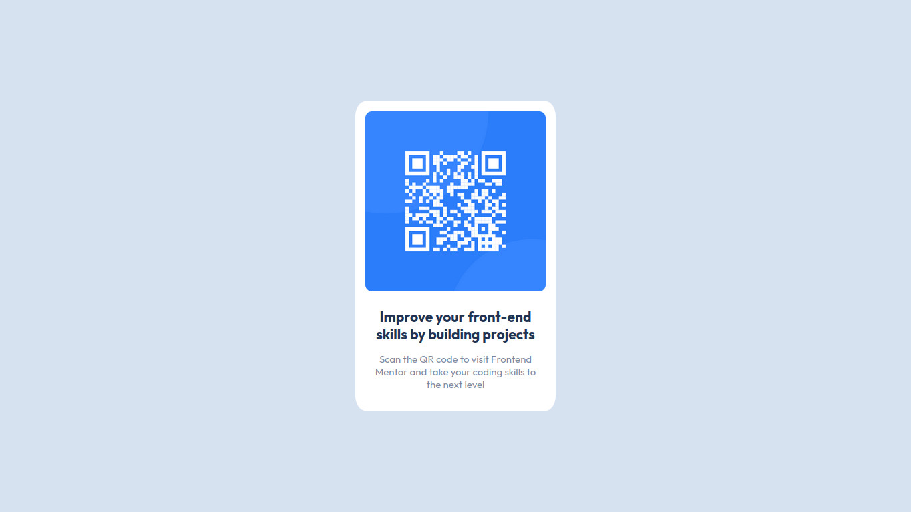

# Frontend Mentor - QR code component solution

This is a solution to the [QR code component challenge on Frontend Mentor](https://www.frontendmentor.io/challenges/qr-code-component-iux_sIO_H).

## Screenshot

- Live Site URL: [Add live site URL here](https://your-live-site-url.com)

## Built with

- Semantic HTML5 markup
- CSS properties

## Author

- Website - [Eduardo Braga](https://github.com/iambraga)
- Frontend Mentor - [@iambraga](https://www.frontendmentor.io/profile/iambraga)
